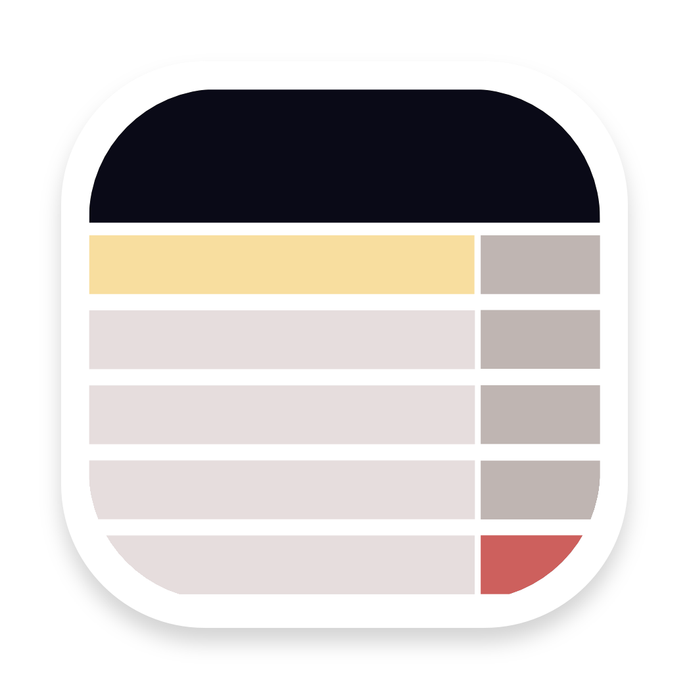
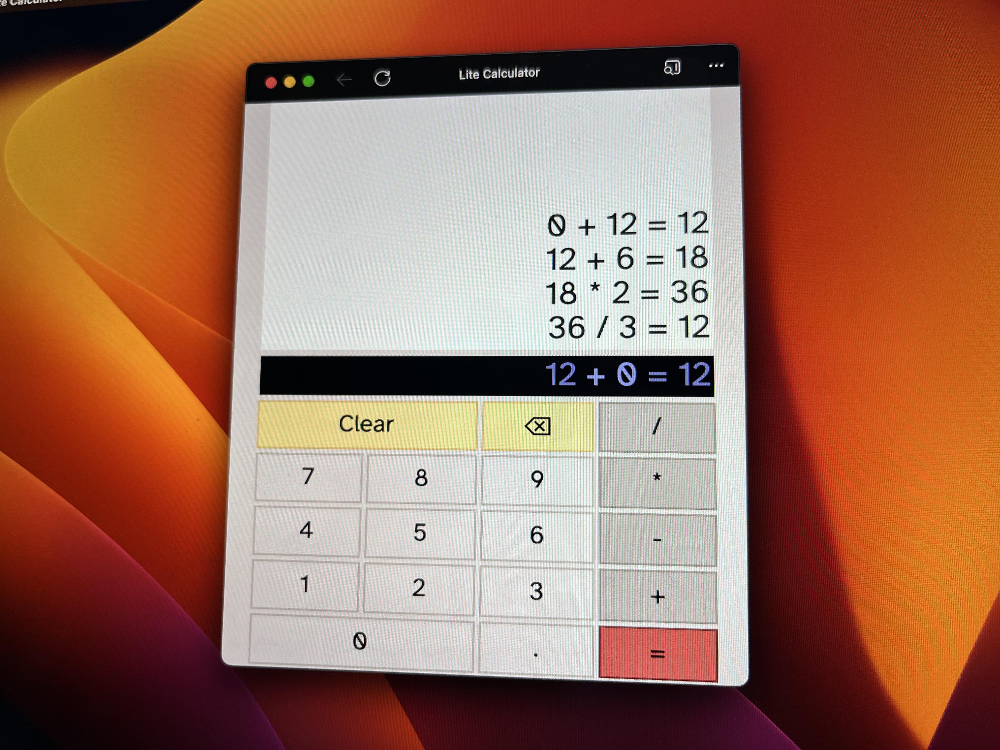

	

# Lite Calculator

Simple Calculator Web-App written with Tram-Lite

You can go to the live web-app here: https://jrjurman.com/lite-calculator/

	

## Libraries

Lite Lists is mostly an experiment in using [Tram-Lite](https://github.com/Tram-One/tram-lite) - a simple view library
for building web-components.

Additionally, this project uses the Atkinson Hyperlegible font - you can read more and download it here:
https://brailleinstitute.org/freefont
